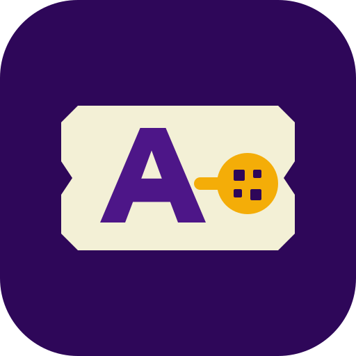
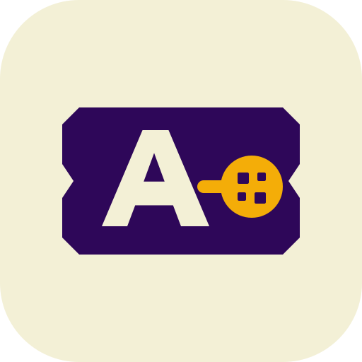

# Aryan

**Founder & CEO**, [ExamCodes](https://examcodes.site) &bull; **Founder & CEO**, Aranch Pass  
**CTO**, KronosSMM &bull; **CTO**, DETRATEBTU  
*Systems & Infrastructure Engineer &bull; Distributed Software Architecture*

Building distributed software, high-throughput network engines, and physical/digital identity systems since 2022 (~3.5+ years of shipping code).  
*Primary open-source engineering profile migrated to `@thatonearyan-sh`.*

---

### Ventures & Leadership

<table border="0" style="border: none; background: transparent; border-collapse: collapse;">
  <tr style="border: none; background: transparent;">
    <td width="112" valign="middle" align="center" style="border: none; background: transparent; padding-right: 18px;">
      
    </td>
    <td valign="middle" align="left" style="border: none; background: transparent;">
      <b>Founder &amp; CEO</b> &mdash; <b><a href="https://examcodes.site">ExamCodes</a></b> &bull; <code>1,100+ Monthly Active Users</code> 
      Digital learning infrastructure platform and competitive examination marketplace serving 1,100+ monthly active students. Engineered with React, Supabase real-time persistence, and automated financial transaction pipelines.
    </td>
  </tr>
  <tr style="border: none; background: transparent;">
    <td width="112" valign="middle" align="center" style="border: none; background: transparent; padding-right: 18px; padding-top: 18px;">
      &nbsp;
    </td>
    <td valign="middle" align="left" style="border: none; background: transparent; padding-top: 18px;">
      <b>Founder &amp; CEO</b> &mdash; <b>Aranch Pass</b> 
      Physical identity and asset verification system. Numbered, traceable passport-seal architecture connecting physical products to authenticated digital service layers.
    </td>
  </tr>
  <tr style="border: none; background: transparent;">
    <td width="112" valign="middle" align="center" style="border: none; background: transparent; padding-right: 18px; padding-top: 18px;">
      &nbsp;
    </td>
    <td valign="middle" align="left" style="border: none; background: transparent; padding-top: 18px;">
      <b>Chief Technology Officer &amp; Lead Systems Developer</b> &mdash; <b>KronosSMM</b> &bull; <code>TG-KRONOS v2.0</code> 
      Institutional Telegram growth, virtual telephony &amp; fulfillment infrastructure. Lead developer of the automated virtual numbers provisioning engine&mdash;architected in Python AsyncIO, Pyrogram/Telethon MTProto pipelines, DDD domain layer, AES-256 encrypted session vaults, dynamic multi-country inventory management, and automated OTP delivery rails.
    </td>
  </tr>
  <tr style="border: none; background: transparent;">
    <td width="112" valign="middle" align="center" style="border: none; background: transparent; padding-right: 18px; padding-top: 18px;">
      &nbsp;
    </td>
    <td valign="middle" align="left" style="border: none; background: transparent; padding-top: 18px;">
      <b>Chief Technology Officer</b> &mdash; <b>DETRATEBTU</b> 
      Institutional-grade market telemetry, dynamic cryptocurrency consensus (TonAPI v2, Binance, CoinGecko), AST financial mathematics engine, and 2x Retina WebP visual spot card rasterizer.
    </td>
  </tr>
</table>

---

### Core Engineering Focus

- **Virtual Numbers & Telephony Engines**: High-throughput virtual phone number routing, MTProto/Pyrogram OTP validation, multi-country inventory lifecycles, and AES-256 session state machines.
- **Distributed Systems & Protocols**: Multi-session client synchronization, MTProto presence stripping, real-time WebSocket event buses, and asynchronous RPC query architectures.
- **In-Memory Volatile Security**: Ephemeral RAM-only payload decryption, hardware-fingerprinted licensing, and zero-disk process execution.
- **Financial & Blockchain Rails**: Autonomous on-chain transaction monitoring (TON Network), memo-matched settlements, and unified UPI verification gateways.

---

### Technical Arsenal

- **Languages:** `Python` &bull; `TypeScript` &bull; `JavaScript` &bull; `C++` &bull; `SQL` &bull; `Bash`
- **Backend & Systems:** `FastAPI` &bull; `AsyncIO` &bull; `Pyrogram / Telethon` &bull; `MTProto` &bull; `Node.js` &bull; `WebSockets` &bull; `Linux` &bull; `Docker`
- **Architecture & Security:** `Domain-Driven Design (DDD)` &bull; `AES-256 Session Vaults` &bull; `Stream Ciphers (SHA-256 CTR)` &bull; `Reverse Engineering` &bull; `SOCKS5/Tor Routing`
- **Data & Cloud:** `PostgreSQL` &bull; `Supabase` &bull; `MongoDB Atlas` &bull; `Redis` &bull; `TON Network` &bull; `Vercel Serverless`

---

### Communications

- **Email:** [thatonearyan@gmail.com](mailto:thatonearyan@gmail.com)
- **GitHub:** [@thatonearyan-sh](https://github.com/thatonearyan-sh)
